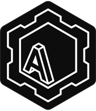

    

# Adae

Adae is the engine powering the Voil digital audio workstation. It is available as a Rust crate, and JavaScript/TypeScript bindings exist for the Node-API through [adae-node](https://github.com/sockmaster27/adae-node#readme) on npm.

## License

Adae is available under an [MIT license](./LICENSE).

By contributing, you agree that your contributions will be licensed under the projects MIT License.
